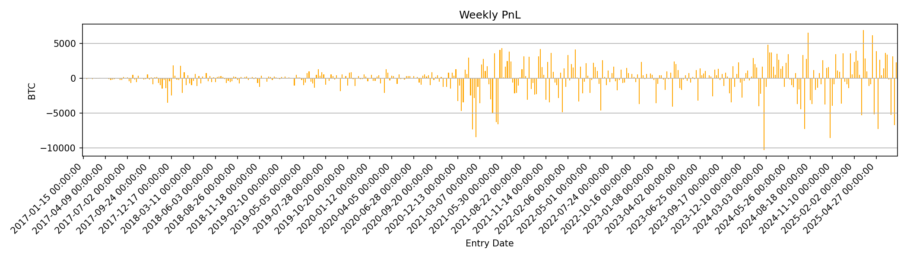
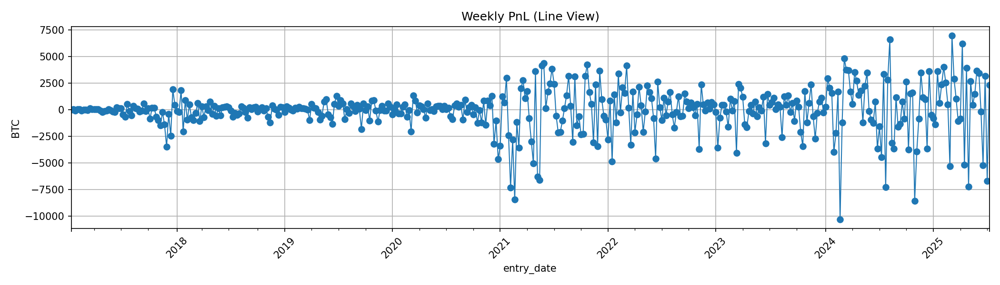

# BTC Short Vol Premia

A fully BTC-denominated backtest framework to simulate and analyze
options strategies such as short strangles on Bitcoin. Built from
scratch using Python and synthetic options chains generated from BTC
price data and realized volatility.

---

## Overview

This project simulates a weekly **short ATM strangle** strategy on
BTC, using synthetic options priced via Black-Scholes with volatility
derived from BTC realized returns.

It includes:
- BTC price + volatility data enrichment
- Synthetic option chain generator
- Realistic strangle PnL tracking
- Cumulative BTC-based performance simulation
- Risk metrics + visual analytics (Sharpe, drawdown, win rate)

All logic is expressed in **BTC terms**, treating BTC as the unit of account.

---

## Strategy Logic

### Sell Strangle

> Sell 1 BTC-denominated ATM call + 1 ATM put each week. Hold to
> expiry. Track PnL in BTC.

**Key assumptions:**
- Options expire in 7 days
- ATM strike is rounded from current spot
- IV is based on 10-day realized volatility with skew
- No delta hedging or early exit (baseline)
---

## Project Structure
```
btc-short-vol-premia/
├── data/
│   ├── btc_price.csv                # Raw BTC price from Yahoo
│   ├── btc_price_enriched.csv      # With log returns + realized vol
│   └── options_chain.csv           # Synthetic options (calls + puts)
├── docs/
│   ├── figures/                     # Notebook figures
│   └── *.md                         # Documents in markdown format (e.g. strategy analysis)
├── script/
│   ├── fetch_btc_data.py           # Get BTC price data from Yahoo Finance
│   ├── generate_options_chain.py   # Builds options_chain.csv
│   └── option_pricing.py           # Prices options
├── strategy/
│   └── sell_strangle.py            # Weekly ATM strangle strategy logic
├── notebook/
│   └── strangle_simulation.ipynb   # Visualize PnL, balance, drawdown
├── main.py                         # Script to run strategy
├── utils/                          # (empty for now, ready for metrics/tools)
└── requirements.txt
```
---

## Key Results

| Metric             | Value (example)   |
|--------------------|-------------------|
| Sharpe Ratio       | -0.19             |
| Win Rate           |  54.3%            |
| Max Drawdown       | -216390.68%       |
| Final BTC Balance  | -23632.0023       |


Results are based on simulating weekly ATM strangles from 2017 onward. All PnL is in BTC.

---

## Getting Started

### 1. Clone the repo
```bash
git clone https://github.com/m4teen/btc-short-vol-premia.git
```
cd btc-short-vol-premia

### 2. Install dependencies
```bash
pip install -r requirements.txt
```
### 3. Generate option data
```bash
python scripts/generate_options_chain.py
```
### 4. Run the strategy
```bash 
python main.py
```
### 5. Or use Jupyter for visuals
```bash 
jupyter notebook notebook/sell_strangle_simulation.ipynb
```

## Sample Visuals

*Figure 1: Cumulative BTC balance over time from the short ATM strangle strategy.*


*Figure 2: Weekly PnL histogram with mean and ±1 SD annotated. Heavy left tail indicates downside risk bias.*


*Figure 3: Combined view of weekly PnL, cumulative PnL, drawdown, and distribution.*


*Figure 4: Weekly PnL per expiry, plotted as a bar chart.*


*Figure 5: Weekly PnL with time series view, helpful for volatility clustering inspection.*


*Figure 6: BTC-denominated cumulative PnL over time.*

## TODO

This section outlines potential next steps to enhance the simulation, deepen the analysis, and expand the project's scope.

- [ ] Add additional strategies for comparison (e.g. delta-hedged put sell, covered calls)
- [ ] Compute advanced metrics: CAGR, volatility, rolling Sharpe, Sortino ratio
- [ ] Add position sizing and margin/collateral modeling for capital efficiency analysis
- [ ] Expand portfolio tracker to handle open positions, mark-to-market PnL, and expiries
- [ ] Include deep dives on: IV skew, tail risk, volatility surface behavior in BTC options
- [ ] Export all final plots and summary metrics into a polished report (PDF or LaTeX)
- [ ] Improve documentation and add usage examples in notebooks and scripts
- [ ] Add unit tests for core simulation and strategy logic
- [ ] Integrate with live data from Deribit or OKX (via API) for forward-testing
- [ ] Repeat for a delta hedge strategy

